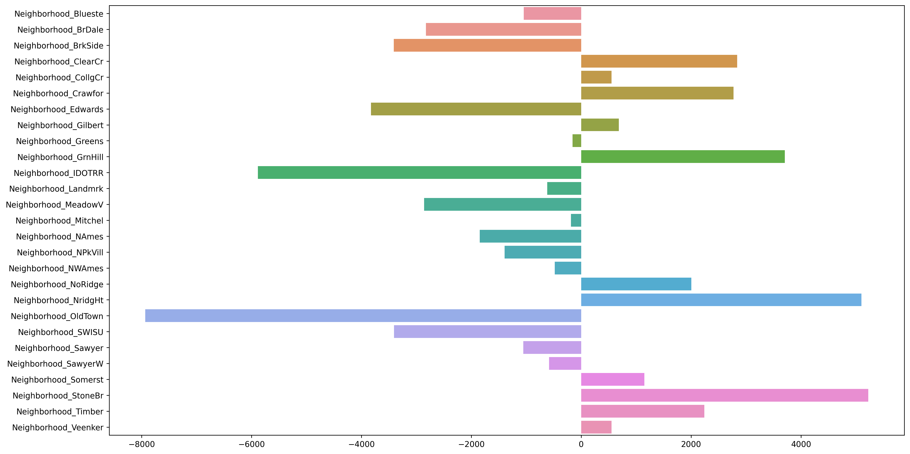

# Predicting Housing Prices

The goal of this project is to model the housing prices with linear regression and have in-depth understanding in the determining factors in sale prices.

    
<h2>Table of Content</h2>

    <ol>
        <li><a href="#data">Data</a></li>
        <li><a href="#model">Model</a></li>
        <li><a href="#primary-findings">Primary Findings</a></li>
        <li><a href="#repository-structure">Repository Structure</a></li>
        <li><a href="#tools">Tool & Libraries</a></li>
    </ol>

## Data

The [dataset](./datasets) contains assessed values for individual residential properties sold in Ames, IA from 2006 to 2010. The training data contains 2051 observations and 81 variables. Click [here](./datasets) for more details.

|   |  Id |       PID | MS SubClass | ... | Sale Type | SalePrice |
|--:|----:|----------:|------------:|----:|----------:|----------:|
| 0 | 109 | 533352170 |          60 | ... |        WD |    130500 |
| 1 | 544 | 531379050 |          60 | ... |        WD |    220000 |
| 2 | 153 | 535304180 |          20 | ... |        WD |    109000 |
| 3 | 318 | 916386060 |          60 | ... |        WD |    174000 |
| 4 | 255 | 906425045 |          50 | ... |        WD |    138500 |

## Model

The linear regression model is fitted with lasso regularization, see table below for the model performance:

|                        | Cross Validation Score |
|------------------------|------------------------|
| Without Regularization |          0.69          |
| With Lasso             |          0.88          |

## Primary Findings

By studying the coefficients of the model, we can inference the most expansive neighbourhoods in Ames, IA:

* Stone Brook
* Northridge Heights
* Green Hills

## Repository Structure

1. [code](./code/)
    > Main code and jupyter notebooks, with detailed instructions and easy to follow along.

2. [datasets](./datasets/)
    > The datasets used for this project.

3. [images](./images/)
    > Images displayed on this document.

4. [pickle](./pickle/)
    > Saved model.

5. [presentation.pdf](./presentation.pdf)
    > Slides for the project.

6. [README.md](README.md)
    > The document you are currently viewing.
---

<h4 id="tools">Tools & Libraries</h4>

